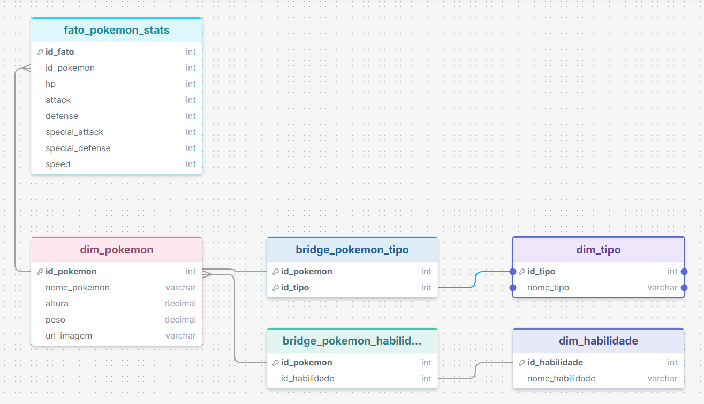

# Descrição do Modelo de Dados (Data Warehouse)

Este documento detalha a especificação técnica da modelagem dimensional adotada para a plataforma de dados Pokémon. O desenho segue os princípios de modelagem Kimball, estruturado em um formato híbrido de **Star Schema** com tabelas **Bridge** para suportar relacionamentos de cardinalidade Muitos-para-Muitos ($N:N$).

## 📊 Diagrama Entidade-Relacionamento (DER)

Abaixo está a representação visual das conexões, chaves e granularidade das tabelas do Data Warehouse:

---

## 📑 Dicionário e Estrutura das Tabelas

### 1. Tabela Fato

#### `fato_pokemon_stats`
Armazena as métricas numéricas agregáveis (atritos de combate e performance) de cada Pokémon. A granularidade desta tabela é de **uma linha por Pokémon**.

| Campo | Tipo de Dado | Restrição | Descrição |
| :--- | :--- | :--- | :--- |
| `id_fato` | SERIAL | PRIMARY KEY | Identificador único da linha da fato. |
| `id_pokemon` | INTEGER | FOREIGN KEY | Chave estrangeira que conecta à `dim_pokemon`. |
| `hp` | INTEGER | NOT NULL | Pontos de vida base (*Hit Points*). |
| `attack` | INTEGER | NOT NULL | Valor base de ataque físico. |
| `defense` | INTEGER | NOT NULL | Valor base de defesa física. |
| `special_attack` | INTEGER | NOT NULL | Valor base de ataque especial. |
| `special_defense` | INTEGER | NOT NULL | Valor base de defesa especial. |
| `speed` | INTEGER | NOT NULL | Valor base de velocidade. |

---

### 2. Tabelas de Dimensão (Dimensões Puras)

### `dim_pokemon`
Dimensão central que contém os atributos de texto descritivos e dados biológicos imutáveis do Pokémon.

| Campo | Tipo de Dado | Restrição | Descrição |
| :--- | :--- | :--- | :--- |
| `id_pokemon` | SERIAL | PRIMARY KEY | Identificador único do Pokémon (ID original da PokeAPI). |
| `nome_pokemon` | VARCHAR(100) | NOT NULL | Nome oficial do Pokémon. |
| `altura` | DECIMAL(10,2) | - | Altura do Pokémon em decímetros/metros. |
| `peso` | DECIMAL(10,2) | - | Peso do Pokémon em hectogramas/quilogramas. |
| `url_imagem` | VARCHAR(255) | - | Caminho ou URL da imagem oficial de alta resolução. |

### `dim_tipo`
Dimensão que lista os tipos elementares únicos existentes no universo Pokémon.

| Campo | Tipo de Dado | Restrição | Descrição |
| :--- | :--- | :--- | :--- |
| `id_tipo` | SERIAL | PRIMARY KEY | Identificador único do tipo. |
| `nome_tipo` | VARCHAR(100) | UNIQUE, NOT NULL | Nome do elemento (ex: *fogo, agua, eletrico*). |

### `dim_habilidade`
Dimensão que armazena todas as habilidades passivas ou movimentos especiais latentes catalogados.

| Campo | Tipo de Dado | Restrição | Descrição |
| :--- | :--- | :--- | :--- |
| `id_habilidade` | SERIAL | PRIMARY KEY | Identificador único da habilidade. |
| `nome_habilidade` | VARCHAR(100) | UNIQUE, NOT NULL | Nome da habilidade (ex: *overgrow, levitate*). |

---

### 3. Tabelas Bridge (Associação Muitos-para-Muitos)

Como as entidades "Tipo" e "Habilidade" possuem um relacionamento de muitos-para-muitos com os Pokémons (um Pokémon pode ter até 2 tipos e até 3 habilidades, e um tipo/habilidade pertence a vários Pokémons), as tabelas abaixo operam desfazendo a cardinalidade $N:N$ para proteger a granularidade da tabela fato.

### `bridge_pokemon_tipo`
Cruza as chaves de Pokémons e seus respectivos tipos elementares.

| Campo | Tipo de Dado | Restrição | Descrição |
| :--- | :--- | :--- | :--- |
| `id_pokemon` | INTEGER | PK, FK | Código do Pokémon (Referência: `dim_pokemon`). |
| `id_tipo` | INTEGER | PK, FK | Código do tipo (Referência: `dim_tipo`). |

### `bridge_pokemon_habilidade`
Cruza as chaves de Pokémons e suas respectivas habilidades.

| Campo | Tipo de Dado | Restrição | Descrição |
| :--- | :--- | :--- | :--- |
| `id_pokemon` | INTEGER | PK, FK | Código do Pokémon (Referência: `dim_pokemon`). |
| `id_habilidade` | INTEGER | PK, FK | Código da habilidade (Referência: `dim_habilidade`). |

---

## 📈 Índices e Integridade de Dados

Para garantir a integridade referencial em nível de banco de dados e a performance nas consultas analíticas, as seguintes regras físicas foram aplicadas no script de criação (`create_tables.sql`):

1. **Garantia de Não-Duplicação**: As tabelas `dim_tipo` e `dim_habilidade` possuem a restrição `UNIQUE` em seus campos nominais, impedindo que o pipeline insira registros duplicados em caso de reprocessamento.
2. **Deleção em Cascata (`ON DELETE CASCADE`)**: Aplicada em todas as chaves estrangeiras que apontam para `dim_pokemon`. Se um registro de Pokémon for removido ou limpo na dimensão, suas pontuações na tabela fato e seus vínculos nas tabelas bridge são eliminados automaticamente.
3. **Índices de Performance ($B\text{-}Tree$)**: Foram criados índices explícitos para todas as chaves estrangeiras (`id_pokemon`, `id_tipo`, `id_habilidade`) nas tabelas de junção rápida (fatos e bridges). Isso otimiza o tempo de resposta de consultas que utilizam operações de `JOIN` em massa para alimentar ferramentas de dashboard.